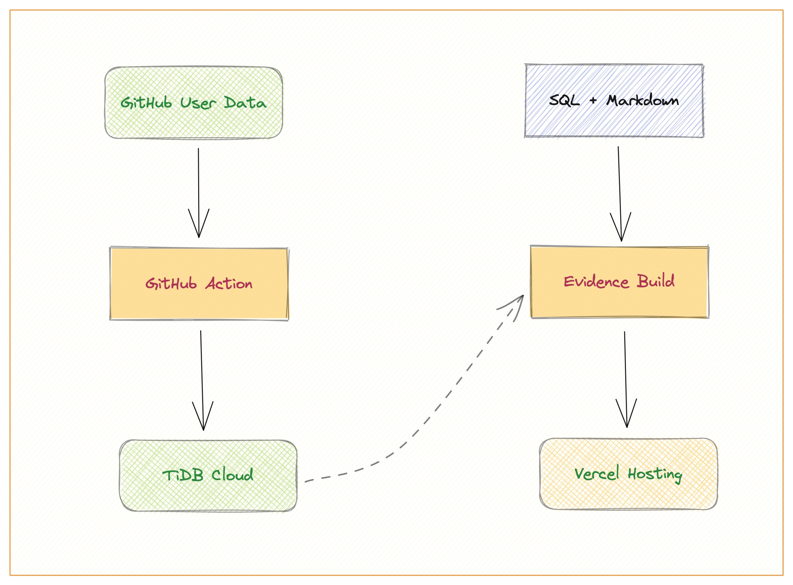

## Oh My GitHub Dashboard

### Description

Oh My GitHub Dashboard is a data front-end display template for [Oh My GitHub Pipeline](https://github.com/hooopo/oh-my-github-pipeline). It is a GitHub personal user dashboard based on Evidence, a static BI generator that uses SQL and Markdown.

### Screenshot

To use this repository as a personal dashboard, after setting up the data pipeline, you can create a web application that queries the MySQL database and displays the data in a user-friendly format.


One option for creating a personal dashboard is to use Evidence (SSG) to display the dashboard on Vercel. You can read the data from TiDB Cloud and build the dashboard every hour.

Using the synced data, you can analyze your GitHub activity and use it for personal branding or as a resume. This repository provides a flexible and powerful solution for syncing and analyzing your GitHub data, whether you use it as a personal dashboard or a standalone data pipeline.


### Vercel deployment

[](https://vercel.com/new/clone?repository-url=https%3A%2F%2Fgithub.com%2Fhooopo%2Foh-my-github-dashboard&env=MYSQL_DATABASE&envDescription=name%20for%20your%20database&integration-ids=oac_coKBVWCXNjJnCEth1zzKoF1j)

## How it works



## SVG api

[svg api](api/svg/[id].ts) will automatically find data from evidence build files. This api uses echarts templates from [api-vis](api-vis).

The final url would be YOUR_VERCEL_DOMAIN/api/svg/CHART_ID?w=480&h=320.

The CHART_ID is the query id from any pages, default width is 640 and default height is 320.

### Customize & Development

```
npm run dev:api
```

> This command will only build evidence pages once, so you **could not** change the SQL after started.

- Add more templates in [api-vis](api-vis) dir, the filename must be the CHART_ID currently. (You must add queries first and restart the dev:api command)
- Edit [\[id\].ts](api/svg/[id].ts) and support more types of charts.
